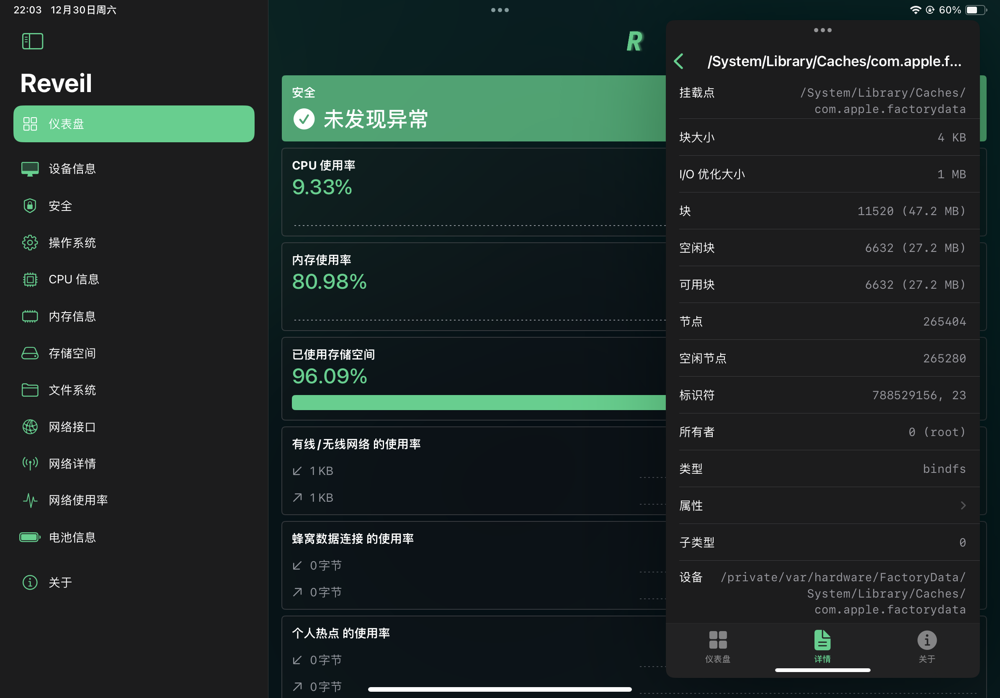

# Reveil

  
 

 [now-on-havoc]: https://havoc.app/package/reveil

[][now-on-havoc]

Reveil is a replication of [Unveil](https://unveilapp.com) in pure SwiftUI.

> Currently, Reveil is in early development, and we are working hard to make it better.

## Requirements

- Xcode 15 or later
- Requires iOS 15.0 or later
- If you're using Xcode 14 or targetting iOS 14, please use the `backport/ios-14` branch.

## Why we developed this again?

Unveil - The most advanced system and security analysis tool. Never got any updates after its initial release.

So we decided to make this app alive again, and open-source it, that's cool. Also, Reveil utilizes complex and innovative techniques to detect possible software modifications or security threats within the iOS application sandbox without relying on exclusive libraries.

## Features

- State-of-the-art Security Analysis
- Visualizes CPU usage (Total/User/Idle), displays CPU specifications, and average load information.
- Visualizes memory usage, displays memory specifications, and classifies memory allocations.
- Displays system version, BootROM version, kernel version, system uptime, and other kernel information.
- Visualizes storage usage and displays the technical storage usage information.
- Lists mounted file systems and displays detailed statistical information such as type/attributes.
- Visualizes internet usage and attributes internet usage to data sources such as WiFi/Ethernet, Cellular connection, or Personal Hotspot.
- Visualizes and displays internet usage information of numerous data sources.
- Displays available network interfaces (e.g. Wired/Wireless, Cellular connection, Access Point, IPSec tunnel) with detailed statistical information (e.g. MTU, Linespeed, Downloaded bytes, Uploaded bytes).

## Limitations

Reveil is not breaking any sandbox rules, so it can't fetch some information shown below:

- CPU frequency
- CPU temperature
- Battery temperature
- Installed applications
- Installed tweaks

...

And not limited to the above.

## Special Thanks

UX/UI design inspired by:

- 🔗 [Unveil](https://unveilapp.com) by [@Pwn20wnd](https://twitter.com/Pwn20wnd)

While creating this tool I used some codes from:

- 🔗 [IOSSecuritySuite](https://github.com/securing/IOSSecuritySuite/tree/master) by [@_r3ggi](https://twitter.com/_r3ggi)

## License

Reveil is licensed under the [MIT License](LICENSE).

Copyright (c) 2023-2024 Lessica & Lakr Aream, All rights reserved.
